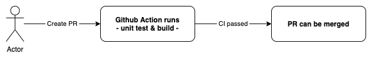
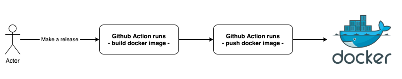

# testing-github-action
Just my dummy repository to learn github action

## Endpoints:
1. `/` --> simulate get data (also print log to stdout)
2. `/set` --> simulate insert data (also print log to stdout)
3. `/error` --> simulate error data (also print log to stderr)

## Jobs

On PR created:

  

On released:

  
